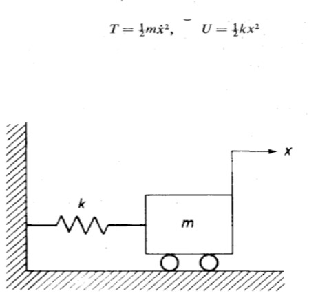
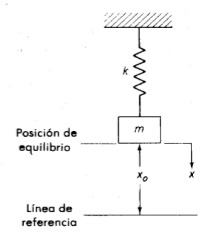
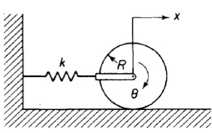

# Sistemas Rotacionales
Conocidos como sistemas que generan movimiento rotativo, los cuerpos que forman el sistema realizan rotaciones en el mismo plano.
estos sistemas estan compuestos por tres componetes fisicos basicos como: elemento de inercia, resortes y elementos de friccion.
Al momento de realizar un modelamiento de este tipo de sistemas se debe tener en cuenta las siguientes leyes:

$$ F_{R} = K\cdot \varphi$$

con \varphi siendo el angulo de torsion

$$ F_{F} = b \frac{\mathrm{d} \varphi }{\mathrm{d} t}$$

Donde $\frac{\mathrm{d} \varphi }{\mathrm{d} t}$ es la velocidad angular

$$ T = J \cdot \frac{\mathrm{d^{2}} \varphi }{\mathrm{d} t^{2}}$$

Donde $\frac{\mathrm{d^{2}} \varphi }{\mathrm{d} t^{2}}$ es el momento de inersia

# Ejemplo
Formula general

$$ T - F_{R} - F_{F} = J *\alpha$$

Donde $\alpha$ es la aceleracion angular

Formula particular

$$ T(t) - F_{F} = J * \alpha$$

Donde $\alpha$ es la aceleracion angular

$$ T(t) * k * \theta (t) - b * \frac{d\theta (t)}{dt} = J * \frac{d^{2}\theta (t)}{dt^{2}}$$

# Trabajo
Es una medida de la realizacion del esfuerzo

$$ W = F_{x}$$    

$$trabajo total realizado = \int_{0}^{x} kxdx=\frac{1}{2}kx^{2}$$

# Energia 
Capacidad de un sistema para realizar trabajo
##Energia potencial
Energía almacenada en un sistema debido a su posición o configuración

$$ U = \int_{0}^{h} mg dx = mgh$$

## Energia cinetica
Energía que un objeto o sistema tiene debido a su movimiento

$$ T = \frac{1}{2}mv^{2}$$

$$ T = \frac{1}{2}J\theta ^{2}$$
 

# Potencia 
La realizacion de trabajo que varia con respecto al tiempo

$$Potencia = P = \frac{dW}{dt}$$

$$Potencia media = \frac{trabajo realizado (t_{2}-t_{1})segundos}{(t_{2}-t_{1})segundos}$$

# Aplicando a elemtentos mecanicos

## Energia potencial en un resorte 
Energía almacenada en un resorte cuando se estira o comprime.

$$ U = \int_{0}^{x} Fdx = \int_{0}^{x} kxdx = \frac{1}{2}kx^{2}$$

forma general cambio de energia 

$$ \Delta U = \int_{x1}^{x2} Fdx = \int_{x1}^{x2} kxdx = \frac{1}{2}kx_{2}^{2} -\frac{1}{2}kx_{1}^{2}$$

## Potencia en un resorte
Se relaciona con la tasa a la que se realiza trabajo para deformar o estirar el resorte, y también on la energía potencial elástica que se almacena en él.

$$ P = \frac{dW}{dt} = \frac{Fdx}{dt} = F \dot{x} = kx\dot{x}$$

## Energia disipada
Energía que se pierde o se convierte en otra forma de energía, generalmente calor, en un sistema.

$$ \Delta W = \int_{x1}^{x2} Fdx = \int_{x1}^{x2} b \dot{x}dx = b \int_{t1}^{t2}\dot{x}^{2}dt$$

## Potencia disipada en amortiguador
Energía que se convierte en calor debido a la fricción y la viscosidad del fluido dentro del amortiguador al absorber energía de vibraciones o impactos.

$$ P = \frac{dW}{dt} = \frac{Fdx}{dt} = F\dot{x}$$

## Sistema consertivo 
Es un sistema donde la energía mecánica total se mantiene constante a lo largo del tiempo, sin pérdidas o ganancias.

$$ \Delta (T+U) = \Delta W$$

Si no entra energia externa entonces 

$$ \Delta (T+U)=0$$

T+U= constante

# Ejemplo 1

Se realiza el modelamiento:

$$T+U=\frac{1}{2}m\frac{\mathrm{d} x}{\mathrm{d} t}^{2}+\frac{1}{2}kx^{2}=constante$$

Al derivar la energia total se obtiene:

$$\frac{\mathrm{d} }{\mathrm{d} t}(T+U)=m\frac{\mathrm{d} x}{\mathrm{d} t}\frac{\mathrm{d^{2}} x}{\mathrm{d} t^{2}}+kx\frac{\mathrm{d} x}{\mathrm{d} t}=(m\frac{\mathrm{d^{2}} x}{\mathrm{d} t^{2}}+kx)\frac{\mathrm{d} x}{\mathrm{d} t}=0$$

$$m\frac{\mathrm{d^{2}} x}{\mathrm{d} t^{2}}+kx=0$$
# Ejemplo 2

En este caso debemos tomar en cuenta las condiciones iniciales como su posicion o si esta en equilibrio para usar estas ecuaiones:

$$U_{o}=mgx_{o}+\frac{1}{2}k\delta ^{2}, k\delta =mg,T=\frac{1}{2}m\frac{dx}{dt}^{2}$$

Teniendo esto presente se comienza con el modelamiento:

$$U=mg(x_{o}-x)+\frac{1}{2}k(\delta +x)^{2}$$

$$U=mgx_{o}-mgx+\frac{1}{2}k\delta^{2}+k\delta x+\frac{1}{2}kx^{2}$$

$$U=mgx_{0}+\frac{1}{2}k\delta ^{2}-(mg-k\delta )x+\frac{1}{2}kx^{2}$$

$$U=U_{o}+\frac{1}{2}kx^{2}$$

Agregamos la ecuacion obtenida al la formula de la energia total:

$$T+U=\frac{1}{2}m\frac{\mathrm{d} x}{\mathrm{d} t}^{2}+U_{o}+\frac{1}{2}kx^{2}=constante$$

Derivando esta ecuacion obtenemos:

$$\frac{\mathrm{d} }{\mathrm{d} t}(T+U)=m\frac{\mathrm{d} x}{\mathrm{d} t}\frac{\mathrm{d^{2}} x}{\mathrm{d} t^{2}}+kx\frac{\mathrm{d} x}{\mathrm{d} t}=0$$

$$(m\frac{\mathrm{d^{2}} x}{\mathrm{d} t^{2}}+kx)\frac{\mathrm{d} x}{\mathrm{d} t}=0$$

$$m\frac{\mathrm{d^{2}} x}{\mathrm{d} t^{2}}+kx=0$$

# Ejemplo 3

Primero debemos Tener en cuenta algunas formulas de estos sistemas:

$$T=\frac{1}{2}m\frac{\mathrm{d} x}{\mathrm{d} t}^{2}+\frac{1}{2}J\frac{\mathrm{d} \theta }{\mathrm{d} t}^{2}$$

$$U=\frac{1}{2}kx^{2}, x=R\theta$$

Comenzamos planteando la ecuacion de la energia total del sistema:

$$T+U=\frac{1}{2}m\frac{\mathrm{d} x}{\mathrm{d} t}^{2}+\frac{1}{2}J\frac{\mathrm{d} \theta }{\mathrm{d} t}^{2}+\frac{1}{2}kx^{2}$$

$$\frac{3}{4}m\frac{\mathrm{d} x}{\mathrm{d} t}^{2}+\frac{1}{2}kx^{2}=constante$$

$$\frac{3}{2}m\frac{\mathrm{d} x}{\mathrm{d} t}\frac{\mathrm{d^{2}} x}{\mathrm{d} t^{2}}+\frac{1}{2}kx\frac{\mathrm{d} x}{\mathrm{d} t}=0$$

$$(m\frac{\mathrm{d^{2}} x}{\mathrm{d} t^{2}}+\frac{3}{2}kx)\frac{\mathrm{d} x}{\mathrm{d} t}=0$$

$$m\frac{\mathrm{d^{2}} x}{\mathrm{d} t^{2}}+\frac{2}{3}kx)=0$$

# Conversion movimiento Translacional - Rotacional
Veremos algunos casos en donde el sistema contiene la relacion de los movimientos traslacionales y rotacionales
## Trenes de engranes, palancas y bandas
En estos sistemas tenemos las siguientes formulas:

$$r_{1}N_{2}=r_{2}N_{1}, \theta _{1}r_{1}=\theta _{2}r_{2}, T_{1}\theta _{1}=T_{2}\theta _{2}$$

$$\frac{T_{1}}{T_{2}}=\frac{N_{1}}{N_{2}}=\frac{\theta _{1}}{\theta _{2}}$$

## Palancas
Para estos sistemas usamos la siguiente formula:

$$\frac{f_{1}}{f_{2}}=\frac{I_{1}}{I_{2}}=\frac{x_{1}}{x_{2}}$$

## Ejemplo

