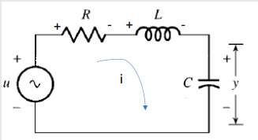
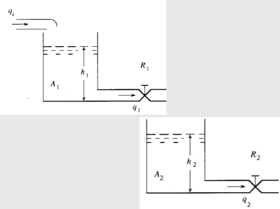

# Sistemas hidraulicos
Se tratan de sistemas que utilizan fluidos a presion para trasmitir fuerza con el fin de mover componentes mecanicos. Este sistema basa su funcioanmiento en el sistema pascal, que dice que la presion que se aplica a un fluido confinado en un sistema cerrado se trasmite en todas las direcciones de manera uniforme.
## Sistema de tanques

En muchos sistemas industriales se desea que el flujo y el nivel se mantengan constantes en todo momento.
Al momento de realizar el modelamiento debemos tener en cuenta las siguientes variables:

$$q_{i}, q_{o}:Flujos de entrada y salida$$

$$R_{1}: Resistencia al flujo$$

$$A_{1}: Area trasversal del tanque$$

$$h_[1]: nivel de liquido en el tanque$$

Tambien debemos tener en cuenta las siguientes formulas:

$$q_{1}=\frac{h_{1}}{R_{1}}$$

$$A_{1}\frac{\mathrm{d} h_{1}}{\mathrm{d} t}=q_{i}-q_{1}$$
# Modelamiento
Para modelar sistemas como el de la anterior imagen realizamos lo siguiente:

$$h_{1}=q_{1}R_{1}

$$R_{1}A_{1}\frac{\mathrm{d} q_{1}}{\mathrm{d} t}=q_{i}-q_{1}$$

# Casos especiales
## Dos tanques

Tenemos este modelo de dos tanques:

Para modelar este tipo de sistemas hacemos lo siguiente:

$$q_{1}=\frac{h_{1}}{R_{1}}\to h_{1}=q_{1}R_{1}$$

$$A_{1}\frac{\mathrm{d} h_{1}}{\mathrm{d} t}=q_{i}-q_{1}\to A_{1}R_{1}\frac{\mathrm{d} R_{1}}{\mathrm{d} t}=q_{i}-q_{1}$$

$$q_{2}=\frac{h_{2}}{R_{2}}$$

$$A_{2}\frac{\mathrm{d} h_{2}}{\mathrm{d} t}=q_{i}-q_{2}\to A_{2}\frac{\mathrm{d} h_{2}}{\mathrm{d} t}=q_{i}-\frac{h_{2}}{R_{2}}$$

$$q_{1}=A_{1}\frac{\mathrm{d} h_{2}}{\mathrm{d} t}+\frac{h_{2}}{R_{2}}$$

