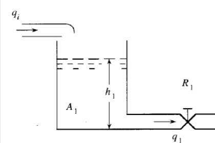

# Sistemas Electricos
Daniel Felipe Ladino, Angel David Melo, Valentina Riveros

Al estudiar dinámica de sistemas, nos encontramos con los sistemas eléctricos normalmente definidos como el conjunto de elementos conectados entre sí con la finalidad de generar, transmitir, distribuir y utilizar la energía eléctrica de manera eficiente y segura.
## Circuito RLC
El modelamiento de sistemas eléctricos RLC (Resistor, Inductor, Capacitor) se realiza con ecuaciones diferenciales. Estas ecuaciones diferenciales normalmente son de primer y segundo orden, se reconocen a simple vista gracias a los elementos acumuladores de energía, debido a la presencia de inductancia y capacitancia. Estas ecuaciones describen el comportamiento dinámico de la corriente y el voltaje en el circuito en función del tiempo.

En los circuitos RLC, las leyes que los rigen son   la ley de Ohm y las leyes de Kirchhoff y los elementos a estudiar se pueden dividir en 3 tipos, en elementos resistivos, inductivos y capacitivos por esto al momento de modelar un sistema eléctrico RLC tenemos que tener encuentra las siguientes fórmulas: 

# Ejemplo 1 de un sistema electrónico RLC

## Elementos del Circuito
- $$\( R \)$$: Resistencia  
- $$\( L \)$$: Inductancia  
- $$\( \frac{1}{1000} \)$$: Posiblemente el valor de la capacitancia $$(\ C = \frac{1}{1000} \text{ F} \)$$  
- $$\( u \)$$: Fuente de voltaje de entrada  
- $$\( v \)$$: Voltajes en componentes (subíndices indican el componente)  
- $$\( c \)$$: Posible error tipográfico (debería ser \( C \) para capacitancia)  
- $$\( y \)$$: Variable de salida (voltaje en el capacitor)  
 
## Aplicación de la Ley de Kirchhoff

La ecuación fundamental obtenida es:  
$$-u + v_R + v_L + v_C = 0$$  

Que se desarrolla como:  
$$-u(t) + i(t) \cdot R + L \frac{di(t)}{dt} + y(t) = 0$$  

## Transformación a términos de \( y(t) \)

Como \( y(t) \) es el voltaje en el capacitor (\( v_C \)), se usa la relación:  
$$i(t) = C \frac{dy(t)}{dt}$$  

Sustituyendo se obtiene la ecuación diferencial final:  
$$-u(t) + RC \frac{dy(t)}{dt} + LC \frac{d^2 y(t)}{dt^2} + y(t) = 0$$  

Esta es una ecuación diferencial de segundo orden que describe la dinámica del circuito RLC en serie, donde:  
- $$\( u(t) \)$$: Entrada (fuente de voltaje)  
- $$\( y(t) \)$$: Salida (voltaje en el capacitor)  
- **Términos**:  
  - $$\( RC \frac{dy(t)}{dt} \)$$: Componente resistivo  
  - $$\( LC \frac{d^2 y(t)}{dt^2} \)$$: Componente inductivo  
  - $$\( y(t) \)$$: Componente capacitivo

# Ejemplo 2 de un sistema electrónico RLC
 
## Ecuaciones del Circuito

### Ley de Kirchhoff de Voltajes
$$ u(t) - \frac{2}{0.5} \frac{dy(t)}{dt} - \frac{1}{0.5} y(t) - 2 \frac{dy(t)}{dt} = 0 $$

### Ley de Kirchhoff de Corrientes (Nodo A)
$$ i_u - i_1 - i_c = 0 $$
$$ i_u(t) - \frac{V_{AB}}{0.5} - 2 \frac{dy(t)}{dt} = 0 $$

### Relación de Voltajes
$$ V_{AB} = i_c \cdot 1Ω + y(t) $$
$$ V_{AB} = 2 \frac{dy(t)}{dt} \cdot 1Ω + y(t) $$

### Ecuación Diferencial Final
$$ u(t) - 6 \frac{dy(t)}{dt} - 2y(t) = 0 $$

En este ejemplo debemos resaltar que la ecuación diferencial obtenida es de primer orden, esto debido a que el circuito planteado solo tiene un elemento acumulador de energía. 
